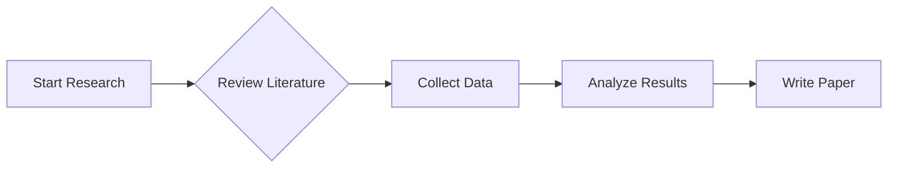

# Tech Tacos: Markdown Magic (in GitHub)

Welcome to Markdown Magic! This repository is designed for a Tech Taco workshop that explores three powerful ways to enhance your Markdown documents:
1. **Math** Notation - Write beautiful equations using LaTeX
2. **Mermaid** Diagrams - Create flowcharts, timelines, and more
3. Job **Market** Websites - Build a professional job market profile

Whether you're writing research papers, documenting code, planning projects, or building your professional presence, these tools will make your Markdown documents more expressive and professional.

For more about the basics of markup and Markdown, check out the [Learning-Markdown](https://github.com/drklis/Learning-Markdown) repo.


## What You'll Learn
### Math in Markdown: What is LaTeX?
Both LaTeX and Markdown are examples of markup language. You can learn how to use LaTeX math notation in Markdown to make pretty equations for repos and GitHub pages.

LaTeX is a markup language, based off of TeX. TeX was designed for scientists and mathematicians to write clean-looking academic papers that could render mathematical notation for printing and viewing on screens. 

GitHub has incorporated LaTeX math notation directly into its Markdown rendering through [MathJax](https://www.mathjax.org/). By using the math environment delimiters directly in a Markdown (.md) file, you can display an equation as it was meant to be. Math notation allows you to communicate complex mathematical ideas clearly, whether in documentation, homework, or research notes.

#### Example

Let's consider the well-known **quadratic formula**, which takes the coeffiecients in a quadratic form and solves for the variable value that sets the equation equal to zero. For this example, we will look at two equations: the quadratic form, and the quadratic formula. Each will be written in plain text, LaTeX math notation, and code snippet. Notice how much nicer the math looks when rendered properly!

###### Quadratic Form

|     | Code | Output |
| -------- | ------- | ------- |
| Plain  | ```a x^2 + b x + c = 0```  | a x^2 + b x + c = 0 |
| LaTeX | ```$a x^2 + b x + c = 0$```| $a x^2 + b x + c = 0$ |

###### Quadratic Formula

|     | Code | Output |
| -------- | ------- | ------- |
| Plain  | ```x = (-b +- (b^2 - 4 a c)^1/2)/2a```  | x = (-b +- (b^2 - 4 a c)^1/2)/2a |
| LaTeX | ```$x = \frac{-b \pm \sqrt{b^2 - 4 a c}}{2a}$```| $x = \frac{-b \pm \sqrt{b^2 - 4 a c}}{2a}$ |


### Visualizing Diagrams: Why use Mermaid?

Mermaid is a "JavaScript based diagramming and charting tool that renders Markdown-inspired text definitions to create and modify diagrams dynamically" ([MermaidChart.com, "About Mermaid"](https://docs.mermaidchart.com/mermaid-oss/intro/index.html#about-mermaid)[^1]). Mermaid diagrams help you visualize processes, relationships, and timelines without leaving your text editor or needing specialized software.

Having good documentation for your project/repo is crucial to building and promotion. Diagrams can assist with understanding complex processes, but drawing those diagrams takes time (by hand, with shapes in Word or Paint, with a whiteboard program like Lucidspark), especially if they can get outdated quickly by further developments. Mermaid attempts to address this by having you "code" the diagram, so that you don't have to switch to another program and save an image, but you can directly type it in the Markdown document. Even non-programmers (or those just starting to learn Mermaid) can create detaled diagrams using the [Mermaid Live Editor](https://mermaid.live/) online and copy the code over. Moreover, because the diagrams are text/code-based, they can be version-controled alongside the rest of your documentation. 

Mermaid has a number of existing chart/diagram types that have already been coded and which you can learn to adjust with your data. These include flowcharts, sequence diagrams, Gantt charts, pie charts, and more.

*Did you know? LaTeX can also create diagrams by loading the package TikZ, which uses a similar coding approach to diagrams as Mermaid. This would be done outside of Markdown, however.*

#### Example

Let's look at a simple flowchart about the research process. Below you'll see the code snippet, and then that snippet rendered as a Mermaid chart.

```
graph LR
    A[Start Research] --> B{Review Literature}
    B --> C[Collect Data]
    C --> D[Analyze Results]
    D --> E[Write Paper]
```



### Academic Profiles: How to Make a Job Market Website Using GitHub Pages

Professional websites showcase your work and make you more visible to potential employers and collaborators, and they are especially important for graduating PhD Students. 
1. You can learn how to create a simple website through GitHub Pages that uses Jekyll and Markdown by following the tutorial available from the [skills/github-pages](https://github.com/skills/github-pages) repo.
2. You can use our [Jekyll for Job Market](https://github.com/ECON-691/Jekyll-for-Job-Market) repo to adapt your own simple academic job market profile (customized with NIU colors!).

## Workshop Activities
Choose your adventure - you can work through one, two, or all three of these activities! If you're a graduate student going on the job market within the next year, go ahead and skip to the academic website and start inputting your info, portrait, and job docs. For everyone else, we'll walk through math and Mermaid first.

### Instructions
1. Clone this repo for yourself. (Click the green "Use this template" button and follow the prompts.)

#### Math in Markdown
2. At the top of the page, click "Add file." Then, on the drop-down menu, right-click "Create new file" and open in a new tab.
3. Name your file `math_practice.md` and keep the new tab open.
5. Now, back in the first tab, click on the file `math_instructions.md.` You can either open it in a new tab, or open it in this one.
6. Follow the instructions in the "math_instructions.md" file and work in the "math_practice.md" file you create to practice creating inline equations, display equations, matrices, and more! You can view your changes in either the preview tab, or by committing your changes every so often.

#### Mermaid in Markdown
7. Just like for math, we will work in two tabs. In one tab, click "Add file" to create a new file called `mermaid_practice.md`.
8. Make sure to open the file `mermaid_instructions.md` in a separate tab.
9. Follow the instructions in "mermaid_instructions.md" and work in "mermaid_practice.md" to build flowcharts, timelines, and other diagrams.

#### Job Market Websites in Markdown
10. Clone the [Jekyll for Job Market](https://github.com/ECON-691/Jekyll-for-Job-Market) repo and follow the instructions there.

## What's in this repo?

- A Markdown cheat sheet (from <a href="https://www.markdownguide.org/cheat-sheet/" target="_blank" rel="noreferrer noopener">MarkdownGuide</a>)
- Instructions for the Math and Mermaid activities
- A template for an example math cover page
- A template for a regression project repo
- Examples of different Mermaid diagram types

## Want some links?

'Course you do!

#### LaTeX/Math Resources
- [GitHub Doc on Writing Math](https://docs.github.com/en/get-started/writing-on-github/working-with-advanced-formatting/writing-mathematical-expressions)
- [History of TeX and Some LaTeX Cheats](https://math.vanderbilt.edu/schectex/wincd/intro_to_tex.htm)
- [WebLaTex, A Way to Code LaTeX in GitHub Codespaces](https://github.com/sanjib-sen/weblatex)
- [Free Online Introduction to LaTeX](https://www.overleaf.com/learn/latex/Free_online_introduction_to_LaTeX_(part_1)), also available on [GitHub](https://github.com/jdleesmiller/latex-course/)
- [Overleaf: TikZ package](https://www.overleaf.com/learn/latex/TikZ_package), an intro to using the TikZ package to drawing diagrams in LaTeX

#### Mermaid Resources
- [Mermaid Official Documentation](https://mermaid.js.org/), including the [Getting Started User Guide](https://mermaid.js.org/intro/getting-started.html)
- [mermaid-js/mermaid](https://github.com/mermaid-js/mermaid), the official build of Mermaid available here on GitHub
- [Mermaid Live Editor](https://mermaid.live/) - Use a GUI to build and test your diagrams in real-time
- [rudolfolah/mermaid-diagram-examples](https://github.com/rudolfolah/mermaid-diagram-examples) - A repo of advanced examples of Mermaid diagrams from software engineer [Rudolf Olah](https://github.com/rudolfolah).

[^1]: Accessed October 22, 2025.

