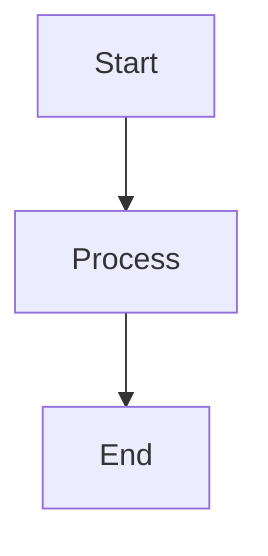
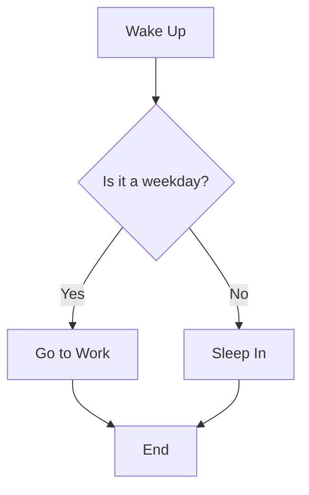
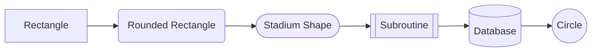
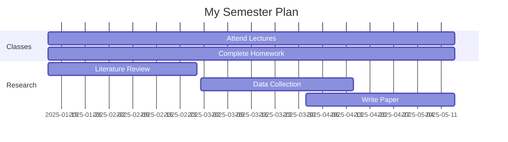
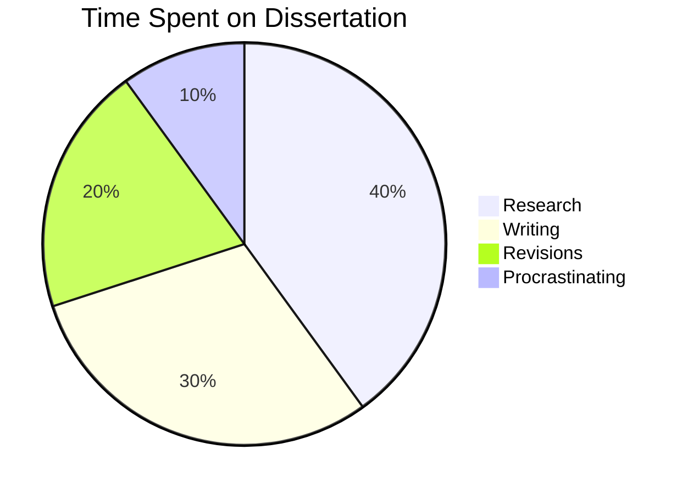

## Step 1: Simple Flowcharts

*Welcome to "Mermaid Diagrams in Markdown"! Let's start with a simple flowchart.*[^1]

Flowcharts are one of the most common diagram types in Mermaid. They help visualize processes, decisions, and workflows. Mermaid code in Markdown documents (like here in GitHub, or in a Markdown editor like Obsidian) is enclosed in a code block with the `mermaid` language tag.

### Example:
````md

````

How it looks:
````mermaid
graph TD
    A[Start] --> B[Process]
    B --> C[End]
````

### Basic Syntax:
- `graph TD` means "graph, top-down direction" (you can also use `LR` for left-right, `BT` for bottom-top, or `RL` for right-left)
- Nodes are defined with letters/numbers and can have text in brackets: `A[Text Here]`
- Arrows connect nodes: `A --> B` means "A points to B"

### :keyboard: Activity: Create your first flowchart

1. Edit the `mermaid_practice.md` file you created.
2. Create a simple flowchart about a process you do regularly (e.g., making coffee, getting ready for class, starting homework). (You can even copy the code snippet above and just change some of the syntax to update it for yourself!)
3. Use at least 3 nodes connected with arrows.
4. Use the **Preview** tab to check your diagram.
5. Commit your changes.

## Step 2: Adding Decisions (Diamond Shapes)

*Great job with your first flowchart! Now let's add decision points.*

Decision points in flowcharts are shown as diamond shapes and typically represent yes/no or true/false questions.

### Example:
````md

````

How it looks:
````mermaid
graph TD
    A[Wake Up] --> B{Is it a weekday?}
    B -->|Yes| C[Go to Work]
    B -->|No| D[Sleep In]
    C --> E[End]
    D --> E
````

### Decision Syntax:
- Use curly braces for diamond shapes: `B{Question?}`
- Label your arrows with text in pipes: `B -->|Yes| C`

### :keyboard: Activity: Add decisions to your flowchart

1. Edit your `mermaid_practice.md` file.
2. Add at least one decision point (diamond shape) to your flowchart.
3. Make sure the decision has at least two possible paths.
4. Label the arrows coming from your decision.
5. Use the **Preview** tab to check your formatting.
6. Commit your changes.


## Step 3: Different Node Shapes

*Excellent work with decisions! Let's explore different node shapes.*

Mermaid supports various node shapes to help distinguish different types of steps in your process.

### Example:
````md

````

How it looks:
````mermaid
graph LR
    A[Rectangle] --> B(Rounded Rectangle)
    B --> C([Stadium Shape])
    C --> D[[Subroutine]]
    D --> E[(Database)]
    E --> F((Circle))
````

### Shape Syntax:
- `[Text]` - Rectangle (default)
- `(Text)` - Rounded rectangle
- `([Text])` - Stadium shape
- `[[Text]]` - Subroutine
- `[(Text)]` - Cylinder/Database
- `((Text))` - Circle
- `{Text}` - Diamond (decision)

### :keyboard: Activity: Use different shapes

1. Edit your `mermaid_practice.md` file.
2. Create a new flowchart (or modify your existing one) that uses at least 3 different node shapes.
3. Try to choose shapes that make sense for your process (e.g., use a database shape for data storage).
4. Use the **Preview** tab to check your formatting.
5. Commit your changes.


## Step 4: Gantt Charts for Timelines

*Great job with flowcharts! Now let's create a Gantt chart for project planning.*

Gantt charts show tasks over time and are perfect for project timelines, semester planning, or research milestones.

### Example:
````md

````

How it looks:
````mermaid
gantt
    title My Semester Plan
    dateFormat YYYY-MM-DD
    section Classes
    Attend Lectures     :2025-01-15, 2025-05-15
    Complete Homework   :2025-01-15, 2025-05-15
    section Research
    Literature Review   :2025-01-15, 2025-02-28
    Data Collection     :2025-03-01, 2025-04-15
    Write Paper         :2025-04-01, 2025-05-15
````

### Gantt Chart Syntax:
- Start with `gantt` and a `title`
- Set `dateFormat` (common format: `YYYY-MM-DD`)
- Use `section` to group related tasks
- Tasks follow the format: `Task Name :start-date, end-date`

### :keyboard: Activity: Create a timeline

1. Edit your `mermaid_practice.md` file.
2. Create a Gantt chart for an upcoming project, your semester, or a research timeline.
3. Include at least 2 sections with 2-3 tasks each.
4. Use realistic dates (you can use dates in the future).
5. Use the **Preview** tab to check your formatting.
6. Commit your changes.


## Step 5: Pie Charts for Data

*Excellent work with timelines! Let's visualize some data with a pie chart.*

Pie charts are great for showing proportions and percentages.

### Example:
````md

````

How it looks:
````mermaid
pie title Time Spent on Dissertation
    "Research" : 40
    "Writing" : 30
    "Revisions" : 20
    "Procrastinating" : 10
````

### Pie Chart Syntax:
- Start with `pie title Your Title Here`
- Each slice: `"Label" : value`
- Values are relative (they don't need to sum to 100)

### :keyboard: Activity: Create a pie chart

1. Edit your `mermaid_practice.md` file.
2. Create a pie chart showing how you spend your time in a week, how you divide your research focus, or budget allocations.
3. Include at least 4 categories.
4. Use the **Preview** tab to check your formatting.
5. Commit your changes.


## Step 6: Explore with Mermaid Live Editor

*Great job learning various Mermaid diagram types! Now let's explore even more possibilities with the Mermaid Live Editor.*

The [Mermaid Live Editor](https://mermaid.live/) is an interactive playground where you can experiment with Mermaid diagrams in real-time. It's perfect for testing new diagram types, troubleshooting syntax, and discovering what's possible with Mermaid.

### What is Mermaid Live?

Mermaid Live is a free online tool that lets you:
- Write Mermaid code and see the diagram update instantly
- Browse sample diagrams to learn new syntax
- Experiment without committing to your repository
- Copy working code to paste into your Markdown files

### :keyboard: Activity: Explore Mermaid Live

1. Open [mermaid.live](https://mermaid.live/) in a new browser tab.
2. Click on the **"Sample Diagrams"** button (looks like a grid icon) in the top toolbar.
3. Browse through the different diagram types available. You should see familiar diagrams that we already covered - flowchart, Gantt chart, pie chart - as well as new options like:
   - Mindmap
   - Sequence
   - Class
   - State
   - Entity Relationship
   - Quadrant
   - User Journey
   - And many more!
4. Click on at least **3-4 different sample diagrams** and observe:
   - How does the code change for each diagram type?
   - What patterns do you notice in the syntax?
   - What kinds of information can each diagram type represent?
5. **Try modifying** one of the sample diagrams:
   - Change some text labels
   - Add a new node or connection
   - Adjust the colors or styles (if applicable)
   - Watch how your changes update the diagram in real-time
6. **Create something new**: Choose a diagram type that interests you and try to create your own diagram from scratch in the Live Editor.
7. Once you have a diagram you like, **copy the code** and paste it into your `mermaid_practice.md` file.
8. Commit your changes to GitHub and check that it renders correctly.

### Diagram Types to Explore

Here are some interesting diagram types you'll find in the Sample Diagrams menu:

- **Class Diagram** - Shows object-oriented programming structures and relationships
- **Entity Relationship** - Perfect for database design and showing how data tables connect
- **State Diagram** - Shows how systems transition between different states
- **Mindmap** - Great for brainstorming and organizing ideas hierarchically
- **Timeline** - Alternative to Gantt charts for showing events chronologically
- **Quadrant Chart** - Useful for prioritization matrices (urgent/important, etc.)
- **Sankey** - Shows flow and proportions (like budget allocations)
- **User Journey** - Maps out user experiences and emotions over time

### Tips for Using Mermaid Live

- **Start with a sample** - It's easier to modify existing code than start from scratch when learning
- **Watch for syntax errors** - If your diagram doesn't render, check for missing brackets, quotes, or keywords
- **Use the export options** - You can download diagrams as PNG or SVG if needed
- **Bookmark useful examples** - When you create something good, save the link or copy the code somewhere safe
- **Don't be afraid to experiment** - The Live Editor is a safe space to try things out!

[^1]: This activity was developed by [drklis](https://github.com/drklis) using Claude AI.
